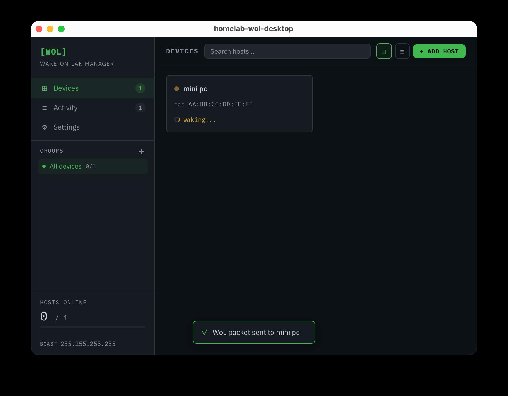
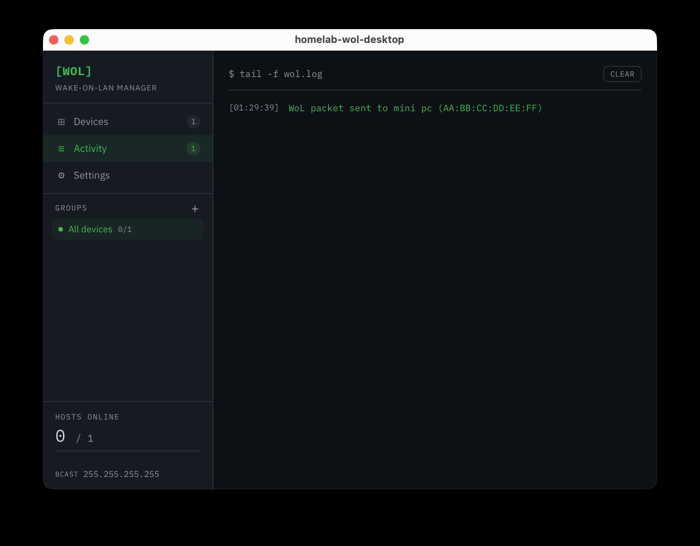
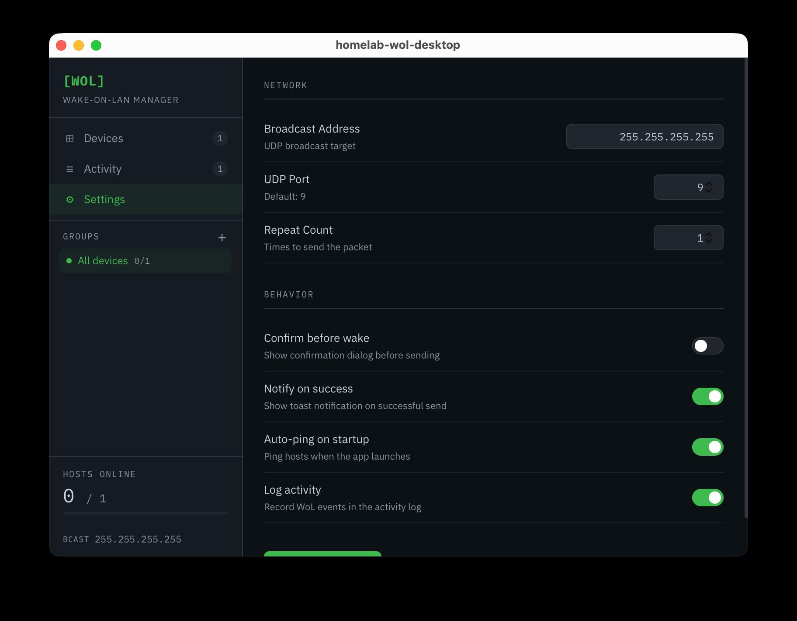

# homelab-wol-desktop

ホームラボのPC群をリモートで起動するための Wake-on-LAN 管理デスクトップアプリ。  
Tauri 2 + React + TypeScript + Rust で構築。

## スクリーンショット

<!-- TODO: pnpm tauri dev でアプリを起動し、各画面を撮影して docs/screenshots/ に保存する -->

**デバイス画面**



**アクティビティ**



**設定**



## 機能

- **デバイス管理**: MACアドレス・IPアドレス・グループでデバイスを登録・編集・削除
- **Wake-on-LAN**: ボタン一つでマジックパケットをUDPブロードキャスト送信
- **死活監視**: 登録済みIPへのpingで `online / offline / waking` ステータスをリアルタイム表示
- **グループ・検索**: デバイスをグループ分けし、名前・MAC・IPで絞り込み
- **アクティビティログ**: WoL送信・ping結果をターミナル風ログで記録
- **設定**: ブロードキャストアドレス、UDPポート、送信回数、各種トグルをGUIで変更
- **永続化**: デバイス・設定はJSONファイルとして自動保存・復元

## 技術スタック

| レイヤー       | 技術                                          |
| -------------- | --------------------------------------------- |
| フロントエンド | React 18 + TypeScript + Vite                  |
| バックエンド   | Rust (Tauri 2)                                |
| テスト         | Vitest (フロント) / `cargo test` (Rust)       |
| CI             | GitHub Actions (format / lint / test / build) |
| 開発環境       | Nix flake                                     |

## アーキテクチャ

フロントエンド（React）は Tauri の `invoke()` を通じて Rust のコマンドを呼び出す。  
ネットワーク操作（UDP送信・ping実行）やファイルI/OはすべてRust側で処理する。

```
React (TypeScript)
  └─ invoke("command_name", args)
       └─ Rust (src-tauri/src/)
            ├─ wol.rs       : マジックパケット生成・UDP送信
            ├─ ping.rs      : OSのpingコマンド実行・RTT解析
            └─ commands.rs  : devices.json / settings.json の読み書き
```

### Tauri コマンド一覧

| コマンド            | 役割                                               | 主な引数                                                |
| ------------------- | -------------------------------------------------- | ------------------------------------------------------- |
| `send_magic_packet` | UDPブロードキャストでマジックパケット送信          | `macAddress`, `broadcastAddr`, `udpPort`, `repeatCount` |
| `ping_device`       | OSの`ping`コマンドで死活確認→RTT(ms)を返す         | `ip`                                                    |
| `load_devices`      | `devices.json` を読み込む                          | —                                                       |
| `save_devices`      | `devices.json` に書き込む                          | `devices`                                               |
| `update_device`     | 配列インデックスで1デバイスを更新                  | `index`, `device`                                       |
| `delete_device`     | 配列インデックスで1デバイスを削除                  | `index`                                                 |
| `load_settings`     | `settings.json` を読み込む（なければデフォルト値） | —                                                       |
| `save_settings`     | `settings.json` に書き込む                         | `settings`                                              |

### ファイル構成

```
src/
├── App.tsx                  # ルートコンポーネント・画面切り替え
├── features/
│   ├── devices/             # デバイス一覧・追加・編集・WoL送信
│   ├── activity/            # アクティビティログ表示
│   └── settings/            # アプリ設定画面
├── components/
│   └── Sidebar.tsx          # サイドバー（ナビ・グループ・統計）
├── hooks/
│   └── useDeviceWake.ts     # WoL送信フロー（送信→ping監視）
├── types/                   # Device / AppSettings / UI型定義
└── lib/                     # ユーティリティ

src-tauri/src/
├── lib.rs                   # Tauriコマンド登録
├── commands.rs              # デバイス・設定のファイルI/O
├── wol.rs                   # マジックパケット生成・UDP送信
├── ping.rs                  # ping実行・RTT解析
└── errors.rs                # エラー型
```

### データ保存場所

| OS      | パス                                                     |
| ------- | -------------------------------------------------------- |
| macOS   | `~/Library/Application Support/com.homelab-wol.desktop/` |
| Linux   | `~/.config/com.homelab-wol.desktop/`                     |
| Windows | `%APPDATA%\com.homelab-wol.desktop\`                     |

`devices.json` と `settings.json` の2ファイルが作成される。

## セットアップ

### 前提条件

このプロジェクトを動かすには、以下のツールがインストールされている必要がある。

- Nix
- direnv

### 環境の起動

ターミナルでプロジェクトルートに移動して、以下のコマンドを実行する。

```bash
echo "use flake" >> .envrc
direnv allow

pnpm install
```

## 開発コマンド

```bash
# 開発
pnpm tauri dev

# ビルド
pnpm build
pnpm tauri build

# テスト・品質チェック
pnpm test -- --run
pnpm test:coverage
pnpm lint
pnpm format
pnpm format:check

cd src-tauri
cargo test
cargo clippy -- -D warnings
cargo fmt
```
